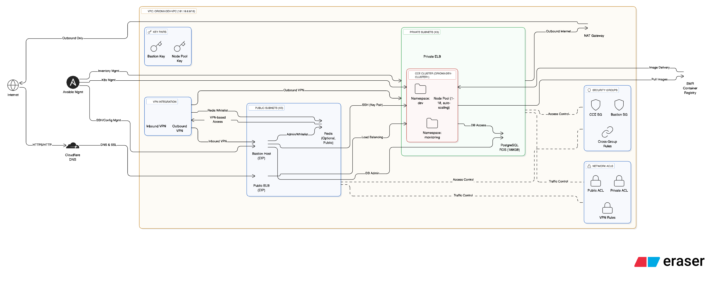

# Huawei Multi-Tier Project - OrionX Infrastructure

A comprehensive Huawei Cloud infrastructure deployment using Terraform that implements a secure, scalable Kubernetes-based platform for the OrionX insurance application. This infrastructure follows Huawei Cloud best practices with custom VPC networking, CCE clusters, and secure bastion host access.

## 🏗️ Architecture Overview

This infrastructure deploys a production-ready Kubernetes platform with the following key components:

- **Cloud Container Engine (CCE)**: Managed Kubernetes cluster with auto-scaling
- **Custom VPC Network**: Secure network segmentation with public/private subnets
- **Bastion Host**: Secure access point for cluster management
- **NAT Gateway**: Controlled outbound internet access
- **PostgreSQL RDS**: Managed database with high availability
- **Software Repository (SWR)**: Private container registry
- **Multi-Zone Deployment**: High availability across multiple zones

## 📊 Architecture Diagram



*The diagram above illustrates the complete Huawei Cloud infrastructure architecture including VPC networking, CCE cluster, bastion host, NAT gateway, and security components.*

## 🌐 Network Architecture

### VPC Configuration
- **Network Name**: `orionx-dev-vpc`
- **CIDR Block**: `101.10.0.0/16`
- **Region**: Africa-South-1 (Johannesburg)
- **Multi-AZ**: High availability deployment

### Subnet Layout
```
Public Subnets (Bastion & Load Balancers):
├── 101.10.64.0/18 - Bastion hosts
├── 101.10.128.0/18 - Load balancers
└── 101.10.192.0/18 - Additional public resources

Private Subnets (Kubernetes & Databases):
├── 101.10.0.0/18 - CCE cluster nodes
├── 101.10.32.0/18 - Database tier
└── 101.10.48.0/18 - Additional private resources
```

### NAT Gateway Configuration
- **Gateway**: `orionx-dev-public-nat-gw`
- **SNAT Rules**: All subnets can use NAT for internet connectivity
- **EIP**: Elastic IP for outbound internet access

## 🚀 Cloud Container Engine (CCE)

### Cluster Configuration
- **Name**: `orionx-dev-cluster1`
- **Flavor**: `cce.s2.small`
- **Network Type**: Overlay L2
- **External IP**: EIP for cluster access
- **Container Network**: Overlay networking

### Node Pool Details
- **Name**: `orionx-dev-nodepool-grp`
- **Flavor**: `s6.2xlarge.2` (8 vCPUs, 16 GB RAM)
- **Node Count**: 1-10 nodes (auto-scaling)
- **Key Pair**: SSH access for node management
- **Security Groups**: Kubernetes cluster security group

### Namespaces
- **Development**: `dev` namespace for application workloads
- **Monitoring**: `monitoring` namespace for observability tools

## 🔧 Bastion Host

### Compute Instance
- **Name**: `orionx-dev-bastion`
- **Flavor**: `s6.xlarge.2` (4 vCPUs, 8 GB RAM)
- **Network**: Public subnet with EIP
- **Security Group**: Bastion-specific security rules
- **Key Pair**: SSH access authentication

### Pre-installed Software
```
Development Tools:
├── Kubernetes CLI (kubectl)
├── Huawei Cloud CLI (hcloud)
├── Docker & Container Tools
├── Git & Development Utilities
└── SSH Key Management
```

### Security Configuration
- **SSH Access**: Key pair authentication
- **Security Group**: Port 22 access control
- **Cross-Group Rules**: Access to CCE cluster

## 🗄️ Database Layer

### PostgreSQL RDS
- **Instance**: Managed PostgreSQL database
- **Storage**: 100 GB database storage
- **Network**: Private subnet for security
- **Security**: Bastion host access only
- **Databases**: Multiple application databases

### Redis Cache (Optional)
- **Instance**: Managed Redis cache
- **Network**: Public subnet with IP whitelisting
- **Access**: VPN-based access control
- **Whitelist**: `110.0.0/16` network range

## 📦 Container Registry (SWR)

### Software Repository
- **Organization**: `orionx-dev`
- **Repository**: `orionx-dev-repo`
- **Region**: Africa-South-1
- **Access**: Private repository with authentication

## 🔐 Security & Access Control

### Security Groups
- **Kubernetes Cluster SG**: Ports 443, 5443, 6443, 5432, 19703, 27017, 6739
- **Bastion SG**: SSH access (port 22)
- **Cross-Group Rules**: Bastion to cluster access

### Network ACLs
- **Public ACL**: Internet-facing traffic control
- **Private ACL**: Internal traffic management
- **VPN Rules**: Specific VPN access patterns

### Access Patterns
```
Internet
    ↓ (HTTPS/HTTP)
Cloudflare DNS
    ↓ (Domain Resolution)
Huawei Cloud ELB
    ↓ (Load Balancing)
CCE Cluster (Private Subnets)
    ↓ (Container Networking)
Applications (Namespaces)
    ↓ (Database Access)
PostgreSQL RDS (Private Subnet)
```

## 🌍 DNS & Certificate Management

### Cloudflare Integration
- **Zone ID**: DNS management
- **Domain Names**: Multiple subdomains for services
- **SSL Certificates**: Automated certificate management

### Service Domains
```
Domain Mappings:
├── web-admin-dev.test.orionxhq.com
├── emple-general-apigateway-service-dev.test.orionxhq.com
├── emple-general-insurance-service-dev.test.orionxhq.com
├── emple-insurance-customer-mgt-dev.test.orionxhq.com
├── emple-insurance-quotation-eng-service-dev.test.orionxhq.com
└── emple-insurance-underwriting-service-dev.test.orionxhq.com
```

## 🔄 Ansible Automation

### NIP Proxy Configuration
- **Development**: Ansible playbooks for dev environment
- **Production**: Ansible playbooks for prod environment
- **Configuration**: Nginx reverse proxy setup
- **Inventory**: Environment-specific host management

## 🚀 Quick Start

### Prerequisites
1. **Huawei Cloud CLI** installed and configured
2. **Terraform** >= 0.12 installed
3. **Huawei Cloud Account** with billing enabled
4. **Service Account** with appropriate permissions

### Authentication Setup
```bash
# Login to Huawei Cloud
hcloud configure

# Set your project
hcloud config set project YOUR_PROJECT_ID

# Create service account (if needed)
hcloud iam service-account create terraform-sa \
  --display-name="Terraform Service Account"
```

### Deployment Steps

#### 1. Configure Variables
```bash
# Copy and modify the environment file
cp environments/dev/dev.tfvars.example environments/dev/dev.tfvars

# Edit the variables
nano environments/dev/dev.tfvars
```

#### 2. Initialize Terraform
```bash
# Initialize Terraform
terraform init

# Review the plan
terraform plan -var-file="environments/dev/dev.tfvars"
```

#### 3. Deploy Infrastructure
```bash
# Apply the configuration
terraform apply -var-file="environments/dev/dev.tfvars"
```

#### 4. Access the Cluster
```bash
# Get cluster credentials
hcloud cce cluster get-credentials orionx-dev-cluster1 \
  --region af-south-1

# Verify cluster access
kubectl get nodes
```

## 📁 Project Structure

```
huawei-multi-tier-poject/
├── main.tf                    # Main infrastructure configuration
├── variables.tf               # Variable definitions
├── locals.tf                  # Local values
├── outputs.tf                 # Output definitions
├── backend.tf                 # Terraform backend configuration
├── providers.tf               # Huawei Cloud provider configuration
├── loadbalancers.tf           # Load balancer configuration
├── vpn-routes.tf              # VPN routing configuration
├── certificates.tf            # SSL certificate management
├── cloudflare.tf              # Cloudflare DNS configuration
├── dns.tf                     # DNS configuration
├── security-group-rules.tf    # Security group rules
├── environments/
│   ├── dev/
│   │   ├── dev.tfvars        # Development environment variables
│   │   └── dev.conf          # Backend configuration
│   └── controlled/
│       ├── controlled.tfvars  # Controlled environment variables
│       └── controlled.conf    # Backend configuration
├── modules/
│   ├── vpc/                  # VPC and networking
│   ├── cluster/              # CCE cluster configuration
│   ├── k8s_node_pool/        # Node pool management
│   ├── bastion-ecs-eip/      # Bastion host configuration
│   ├── rds/                  # PostgreSQL database
│   ├── redis/                # Redis cache
│   ├── swr/                  # Container registry
│   ├── security-group/       # Security groups
│   ├── subnets/              # Subnet configuration
│   ├── eip/                  # Elastic IP management
│   ├── keypair/              # SSH key pairs
│   ├── namespace/            # Kubernetes namespaces
│   ├── database_names/       # Database management
│   ├── loadbalancer/         # Load balancer configuration
│   ├── vpn/                  # VPN configuration
│   └── cloudflare/           # Cloudflare integration
└── ansible-nip/
    ├── dev/                  # Development Ansible configuration
    ├── prod/                 # Production Ansible configuration
    ├── dev-playbook.yml      # Development playbook
    └── prod-playbook.yml     # Production playbook
```

## 🔄 Service Communication

### Network Flow
1. **Internet → Cloudflare**: DNS resolution and SSL termination
2. **Cloudflare → ELB**: Load balancer traffic distribution
3. **ELB → CCE**: Kubernetes service routing
4. **CCE → RDS**: Database connectivity
5. **Bastion → CCE**: Cluster management access

### Security Boundaries
- **Public Subnets**: Bastion hosts and load balancers
- **Private Subnets**: CCE nodes and databases
- **NAT Gateway**: Controlled outbound internet access
- **Security Groups**: Granular access control

## 📈 Scaling and Performance

### Auto Scaling
- **Node Auto Scaling**: 1-10 nodes based on demand
- **Horizontal Pod Autoscaling**: Application-level scaling
- **Multi-Zone**: High availability across zones

### Performance Optimization
- **Regional Deployment**: Multi-zone availability
- **Custom VPC**: Optimized network performance
- **Overlay Networking**: Container-optimized networking
- **EIP Management**: Efficient IP address allocation

## 🛠️ Development Workflow

### Local Development
```bash
# Connect to bastion host
hcloud ecs ssh orionx-dev-bastion --region af-south-1

# Access Kubernetes cluster
kubectl get pods --all-namespaces

# Deploy applications
kubectl apply -f your-app.yaml
```

### Application Deployment
```bash
# Build and push container images
docker build -t swr.af-south-1.myhuaweicloud.com/orionx-dev/orionx-dev-repo:latest .
docker push swr.af-south-1.myhuaweicloud.com/orionx-dev/orionx-dev-repo:latest

# Deploy to CCE
kubectl apply -f k8s/
```

## 🚨 Troubleshooting

### Common Issues
1. **Cluster Access**: Verify bastion host connectivity
2. **Node Scaling**: Check auto-scaling configuration
3. **Network Connectivity**: Validate security group rules
4. **Service Account**: Confirm IAM permissions

### Useful Commands
```bash
# Check cluster status
hcloud cce cluster describe orionx-dev-cluster1 --region af-south-1

# View node pool details
hcloud cce node-pool list --cluster orionx-dev-cluster1 --region af-south-1

# Check security groups
hcloud vpc security-group list

# View EIP allocation
hcloud vpc eip list
```

## 🔄 CI/CD Integration

### GitHub Actions Setup
```yaml
# .github/workflows/deploy.yml
name: Deploy to CCE
on:
  push:
    branches: [main]
jobs:
  deploy:
    runs-on: ubuntu-latest
    steps:
      - uses: actions/checkout@v2
      - name: Setup Huawei Cloud CLI
        uses: huaweicloud/setup-hcloud-cli@v0
        with:
          access_key: ${{ secrets.HUAWEI_ACCESS_KEY }}
          secret_key: ${{ secrets.HUAWEI_SECRET_KEY }}
          region: af-south-1
      - name: Deploy to CCE
        run: |
          hcloud cce cluster get-credentials orionx-dev-cluster1 --region af-south-1
          kubectl apply -f k8s/
```

### Required Secrets
```bash
# GitHub Secrets
HUAWEI_ACCESS_KEY    # Huawei Cloud access key
HUAWEI_SECRET_KEY    # Huawei Cloud secret key
HUAWEI_PROJECT_ID    # Huawei Cloud project ID
```

## 📝 Contributing

1. Fork the repository
2. Create a feature branch
3. Make your changes
4. Test in development environment
5. Submit a pull request

## 📄 License

This project is licensed under the MIT License - see the LICENSE file for details.

## 🤝 Support

For support and questions:
- Create an issue in this repository
- Review the troubleshooting section
- Check Huawei Cloud documentation
- Contact the DevOps team for infrastructure concerns